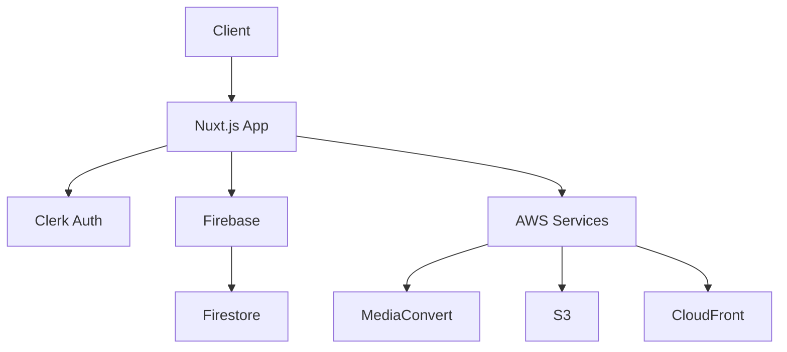

# DreamBees Video Generator

A powerful AI-driven video generation platform that transforms static images into engaging videos.

## Features

- 🎥 AI-powered video generation
- 🔐 Secure authentication with Clerk
- 📁 Video collection management
- 🎨 Custom video settings
- 🚀 High-performance processing

## Security

We implement a robust security system that combines Clerk authentication with Firebase security rules:

- [Firebase Security Overview](docs/FIREBASE_SECURITY.md)
- [Firestore Security Rules](docs/FIRESTORE_RULES.md)
- [Firestore Indexes](docs/FIRESTORE_INDEXES.md)

## Getting Started

1. Clone the repository:
```bash
git clone https://github.com/yourusername/dreambees.git
cd dreambees
```

2. Install dependencies:
```bash
npm install
```

3. Set up environment variables:
```bash
cp .env.example .env
# Edit .env with your configuration
```

4. Set up Firebase credentials:
```bash
npm run setup:firebase
```

5. Start development server:
```bash
npm run dev:all
```

## Development

### Architecture



### Key Components

- **Frontend**: Nuxt.js with Vue 3
- **Authentication**: Clerk
- **Database**: Firebase Firestore
- **Storage**: AWS S3
- **Video Processing**: AWS MediaConvert
- **CDN**: CloudFront

### Security Implementation

Our security architecture combines:
1. Clerk authentication
2. Firebase custom tokens
3. Firestore security rules
4. AWS IAM policies

For detailed security documentation, see [Firebase Security](docs/FIREBASE_SECURITY.md).

## Testing

Run different test suites:

```bash
# Run all tests
npm run test:all

# Test Firebase security rules
npm run test:rules

# Test authentication flow
npm run test:auth

# Test queue system
npm run test:queue:all
```

## Deployment

### Firebase Deployment

Deploy Firestore configuration:
```bash
# Deploy everything
npm run deploy:firestore

# Deploy rules only
npm run deploy:rules

# Deploy indexes only
npm run deploy:indexes
```

### Application Deployment

1. Build the application:
```bash
npm run build
```

2. Preview the build:
```bash
npm run preview
```

3. Deploy to production:
```bash
# Deploy method depends on your hosting platform
```

## Scripts

- `npm run dev` - Start development server
- `npm run build` - Build for production
- `npm run preview` - Preview production build
- `npm run worker` - Start worker process
- `npm run worker:dev` - Start worker in development mode
- `npm run dev:all` - Start all development processes

## Contributing

1. Fork the repository
2. Create your feature branch
3. Run tests and validation
4. Update documentation
5. Create pull request

See [Contributing Guidelines](CONTRIBUTING.md) for more details.

## Security

For security concerns:
1. Review our [Security Policy](SECURITY.md)
2. Check [Firebase Security](docs/FIREBASE_SECURITY.md)
3. Contact security@yourdomain.com

## License

This project is licensed under the MIT License - see the [LICENSE](LICENSE) file for details.

## Support

- Documentation: [docs/](docs/)
- Issues: GitHub Issues
- Email: support@yourdomain.com

## Acknowledgments

- [Clerk](https://clerk.dev/) for authentication
- [Firebase](https://firebase.google.com/) for database
- [AWS](https://aws.amazon.com/) for infrastructure
- [OpenAI](https://openai.com/) for AI capabilities
