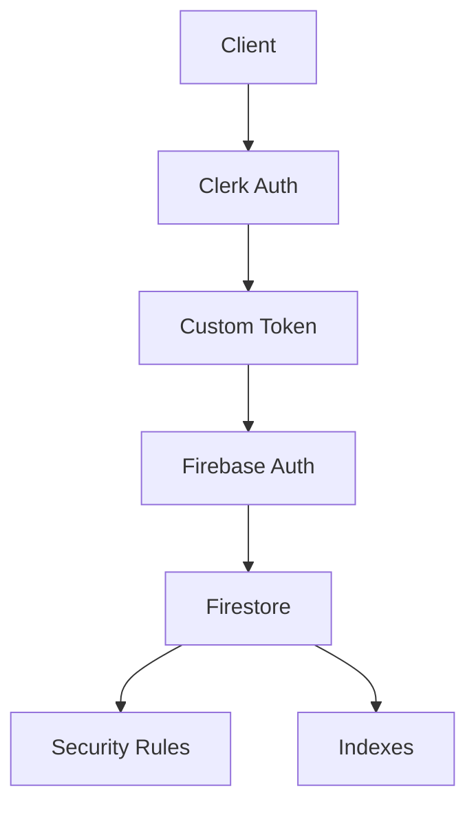

# Firebase Security with Clerk Integration

This document provides an overview of our Firebase security implementation, which integrates Clerk authentication with Firebase security rules and indexes.

## Overview

Our security implementation consists of three main components:
1. Clerk Authentication
2. Firebase Security Rules
3. Firestore Indexes

## Architecture



## Components

### 1. Authentication Flow
- User authenticates with Clerk
- Server generates Firebase custom token
- Client uses token for Firebase operations
- Security rules validate token claims

### 2. Security Rules
Detailed documentation: [Firestore Rules](./FIRESTORE_RULES.md)

Key features:
- User data isolation
- Request validation
- Data structure enforcement
- Access control patterns

### 3. Indexes
Detailed documentation: [Firestore Indexes](./FIRESTORE_INDEXES.md)

Key features:
- Query optimization
- Performance tuning
- Cost management
- Access pattern support

## Implementation

### Client-Side Integration
```typescript
// Use Clerk for authentication
const { getToken } = useClerkAuth()
const token = await getToken()

// Use token with Firebase
const customToken = await getFirebaseToken(token)
await signInWithCustomToken(auth, customToken)
```

### Server-Side Verification
```typescript
// Verify Clerk session
const session = await clerk.sessions.verifySession(sessionToken)

// Generate Firebase token
const customToken = await admin.auth().createCustomToken(session.userId)
```

### Security Rules Example
```javascript
rules_version = '2';
service cloud.firestore {
  match /databases/{database}/documents {
    match /users/{userId} {
      allow read, write: if request.auth.uid == userId;
    }
  }
}
```

## Development Workflow

1. **Local Development**
   ```bash
   # Start emulators
   npm run emulators
   
   # Run tests
   npm run test:rules
   npm run test:rules:with-emulator
   ```

2. **Deployment**
   ```bash
   # Deploy rules and indexes
   npm run deploy:firestore
   
   # Deploy separately
   npm run deploy:rules
   npm run deploy:indexes
   ```

3. **Validation**
   ```bash
   # Validate rules
   npm run validate:rules
   
   # Validate indexes
   npm run validate:indexes
   ```

## CI/CD Integration

Our GitHub Actions workflow automatically:
1. Validates rules and indexes
2. Runs security tests
3. Compares index changes
4. Deploys to production
5. Reports deployment status

## Security Best Practices

1. **Authentication**
   - Always verify Clerk sessions
   - Use short-lived tokens
   - Implement proper token refresh

2. **Authorization**
   - Use granular permissions
   - Validate user ownership
   - Implement role-based access

3. **Data Access**
   - Use collection group queries carefully
   - Implement proper data isolation
   - Monitor query patterns

## Monitoring and Maintenance

1. **Security Monitoring**
   - Regular rule audits
   - Access pattern analysis
   - Security incident response

2. **Performance Monitoring**
   - Query performance tracking
   - Index usage analysis
   - Cost optimization

3. **Maintenance Tasks**
   - Regular rule updates
   - Index optimization
   - Documentation updates

## Troubleshooting

1. **Authentication Issues**
   - Verify Clerk session
   - Check token generation
   - Validate Firebase auth

2. **Rule Violations**
   - Check rule conditions
   - Verify user permissions
   - Review access patterns

3. **Performance Issues**
   - Review indexes
   - Optimize queries
   - Check access patterns

## Testing

1. **Unit Tests**
   ```bash
   npm run test:rules
   ```

2. **Integration Tests**
   ```bash
   npm run test:rules:with-emulator
   ```

3. **Manual Testing**
   - Use Firebase Console
   - Test with emulators
   - Verify in staging

## Resources

- [Clerk Documentation](https://clerk.dev/docs)
- [Firebase Security Rules](https://firebase.google.com/docs/firestore/security/get-started)
- [Firebase Indexes](https://firebase.google.com/docs/firestore/query-data/indexing)

## Contributing

1. Review security documentation
2. Test changes locally
3. Update documentation
4. Create pull request
5. Wait for CI/CD checks
6. Get security review

## Support

For issues related to:
- Authentication: Check Clerk logs
- Rules: Review security rules
- Performance: Check indexes
- Deployment: Review CI/CD logs
